# Cluster Rupture Documentation

In UCERF3, supra-seismogenic ruptures were defined as a unique set of fault subsections. Each of those sections were connected in a single strand, with jumps allowed between parent fault sections (up to a maximum jump distance, and passing various plausibility criteria). Here is a simple cartoon involving 3 faults (with 2 jumps):

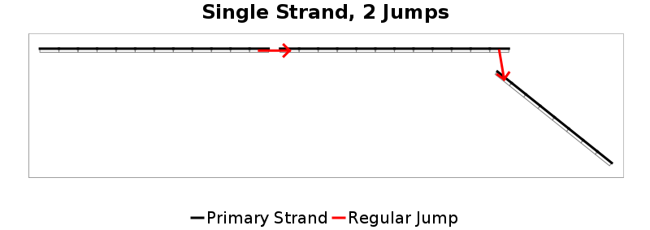

Here is a breakdown of the plausibility critera employed in UCERF3:

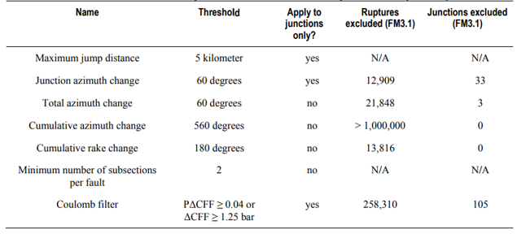

Jumps between faults are only allowed at the closest pair of subsections between each fault (the ends in this simple example). Here are a couple more complicated real UCERF3 ruptures; note that even though these ruptures are complex, you can draw a single path through the ruptures:

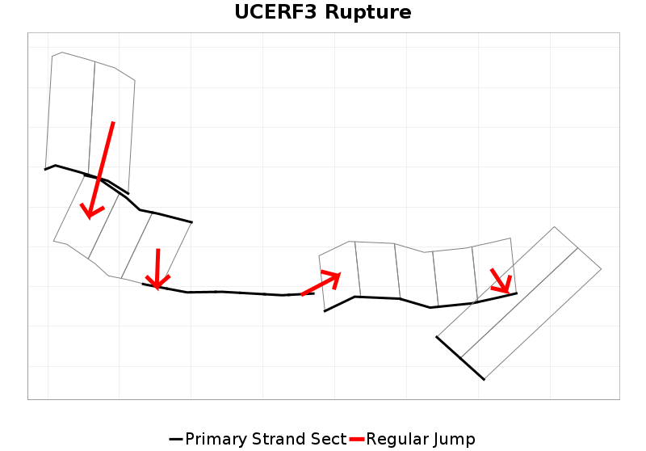
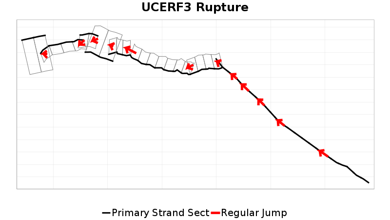

The code used to build UCERF3 ruptures only allowed this particular type of quasi-linear (single strand) rupture, but there are examples in nature (and many in RSQSim) of more complicated rupture behavior. I rewrote the UCERF3 rupture building code to accommodate additional complexity which is outlined below. We may decide that additional complexity is unnecessary for hazard, but I wanted to start things without locking us into the same assumptions as UCERF3.

This new rupture representation, which I call "Cluster Ruptures," allows for splays:

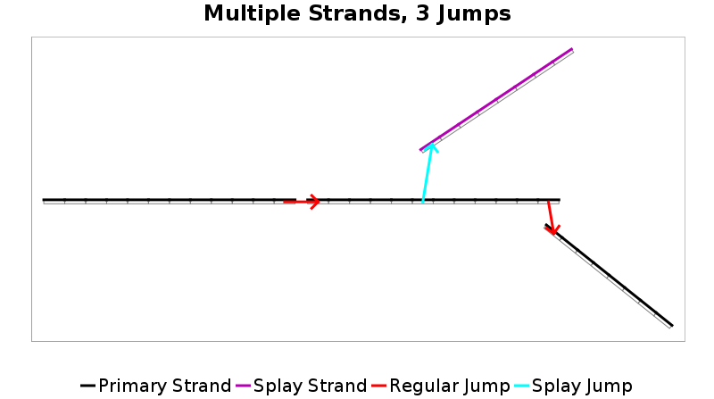

A splay jump occurs whenever a rupture branches into multiple strands. This also occurs whenever a jump happens in the middle of a fault section cluster, as opposed to the end (which was the only allowed jumping point in UCERF3):

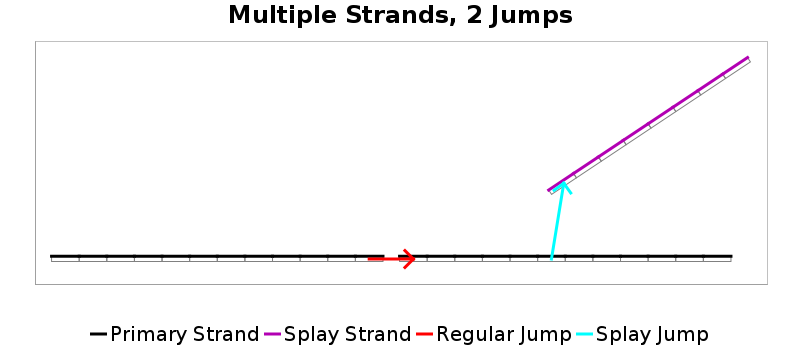

It allows Y-ruptures, which are defined in this framework as a regular jump and a splay jump:

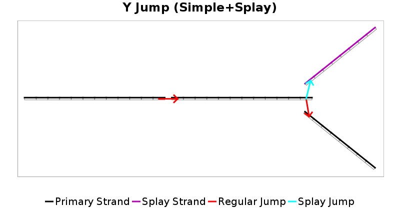

And T-ruptures (which violate UCERF3 construction rules, but don't include splays):

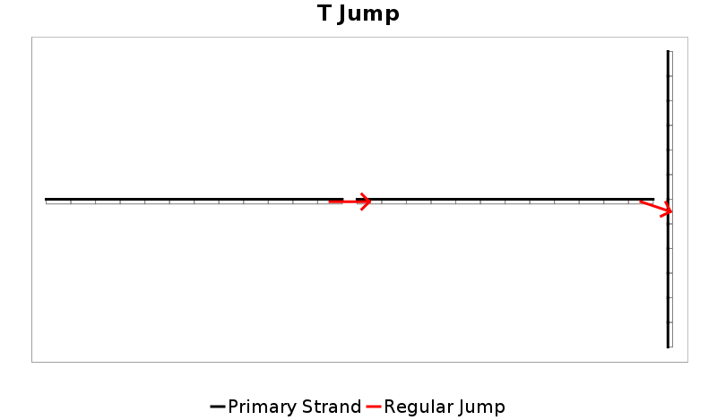

One of the main motivations for this new rupture representation was to be able to more accurately represent RSQSim ruptures in a UCERF-like world, and more fairly test them against UCERF3 rupture plausibility criteria. May UCERF3/RSQSim comparisons are [available here](http://opensha.usc.edu/ftp/kmilner/markdown/rsqsim-analysis/catalogs/rundir4983_stitched/multi_fault/).

Here is one example where we may want to include splay jumps in future UCERF's. Consider a SAF rupture through the Big Bend which also ruptures the Pleito fault coseismically. Here is the UCERF3 representation of that rupture (which was included in the model):

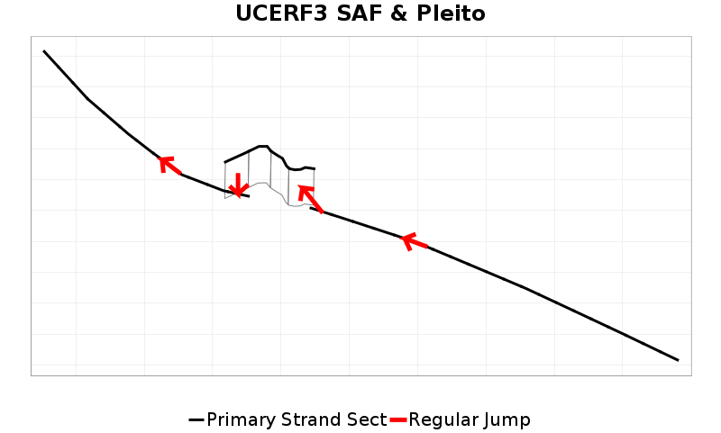

In order to include the Pleito fault, there has to be a gap in the Big Bend section of the SAF. If we allowed splays, then this rupture could be included:

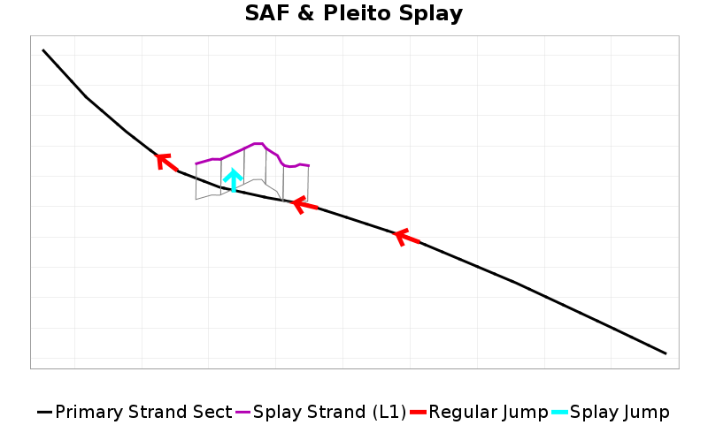

## Notes on Azimuth Change Calculations

UCERF3 relied heavily on azimuth change to constrain possible rupture jumps (typically only allowing up to 60 degrees of azimuth change in a single jump). Here's an example of a UCERF3-style rupture with azimuth arrows drawn in green:

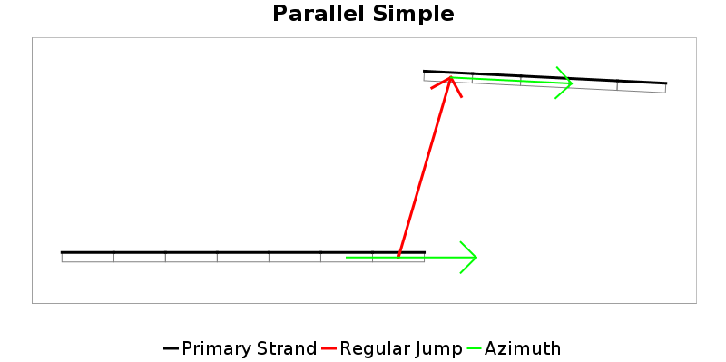

Section azimuths are defined by drawing a vector between the midpoints of last two sections before a jump, and an additional vector between the first two sections after a jump. We did it this way because the direction is undefined if you were to jump to a single subsection that is in the middle of a fault. This is best explained with a cartoon:

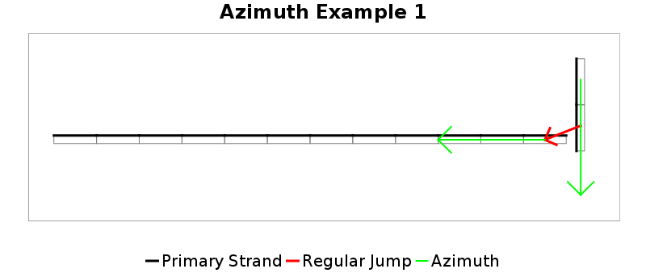

Here, the azimuth of the fault on the right is defined by the second subsection which is included. This is what the azimuths look like for our complicated UCERF3 rupture example above:

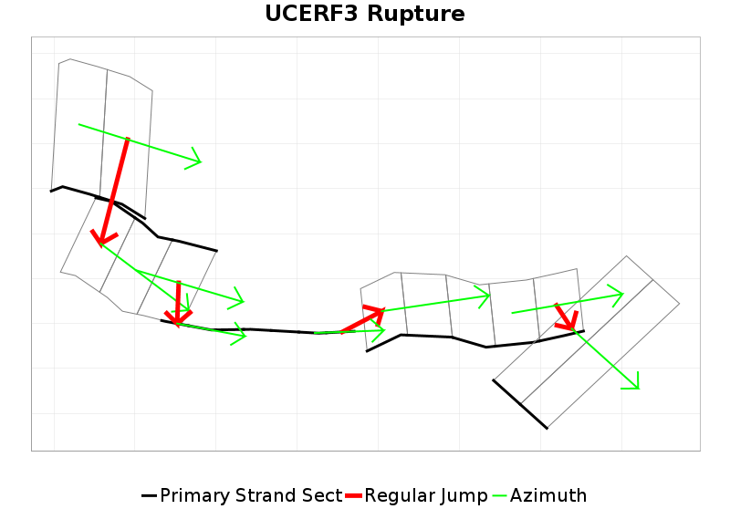

This gets a little more complicated when splays are included. First, consider the following single-strand rupture including 2 nearly-parallel fault sections:

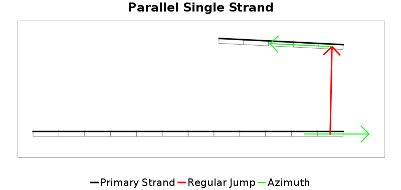

For this rupture, the jumping point is at the right end of the bottom fault, as that is the closest point. This results in an azimuth change of ~180 degrees, which would not pass the UCERF3 rules. Now, lets change things such that the upper fault is angled slightly toward the middle of the bottom fault:

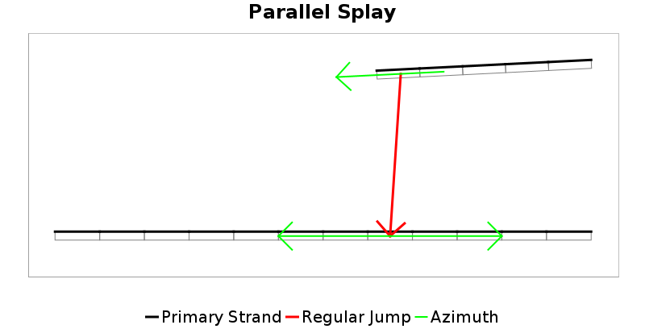

These two rupture examples are almost identical, but their representations in this framework are very different. Now, the closest section pair is in the middle of the bottom fault, and the rupture has a splay. Additionally, the azimuths change is now very small, and would pass the UCERF3 criteria. If we choose to include ruptures with parallel faults, then we must also replace our azimuth criteria with more flexible rules.
