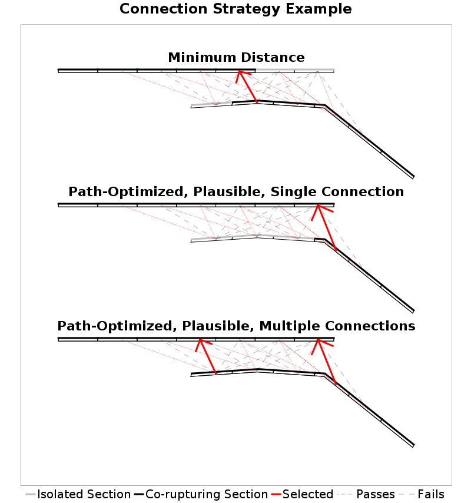
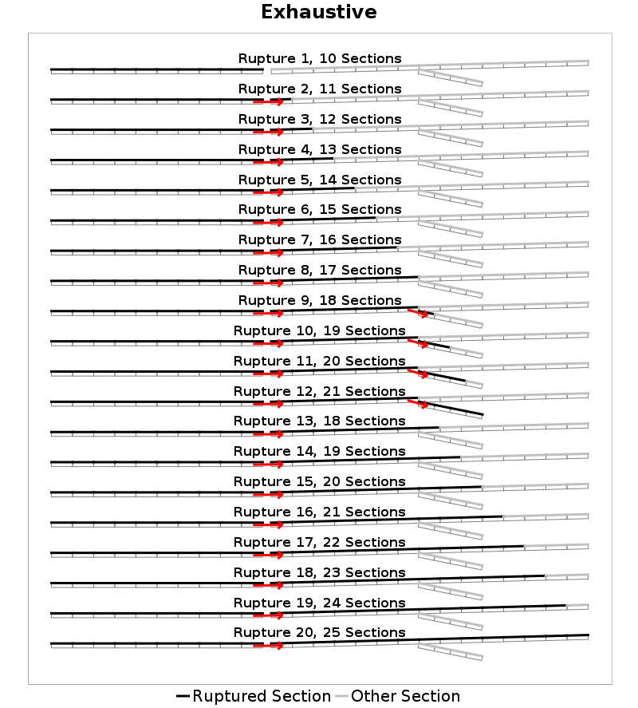
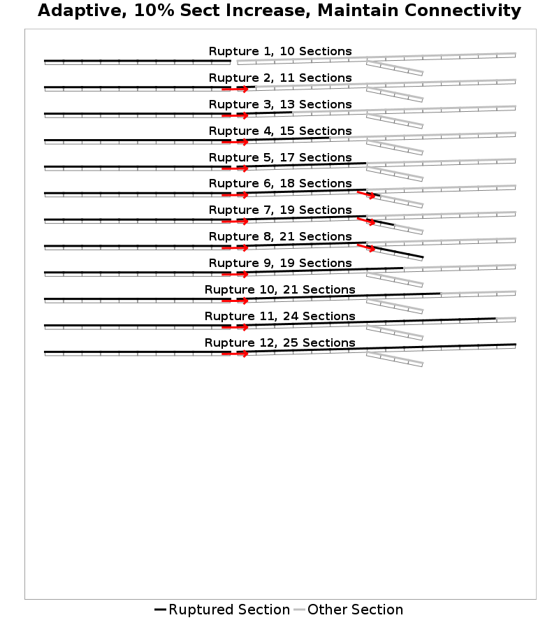
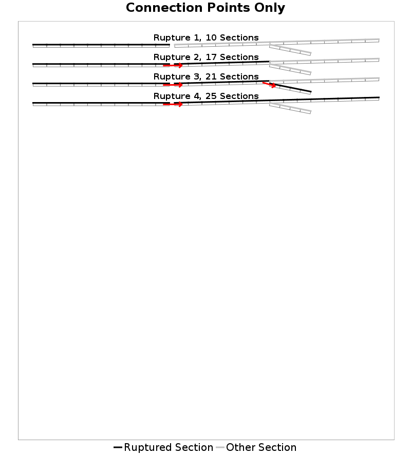

# Connection and Permutation Strategies

Along with plausibility filters, connection and permuation strategies dictate how ruptures are built, and various choices exist for each.

## Connection Strategies

Connection strategies dictate where each pair of fault sections are allowed to connect. Specifically, this strategy decides the subsection pair(s), if any, between two fault subsection clusters where jumps are allowed (and will be tried and tested against plausibility filters by the rupture building algorithm). Examples of connection strategies are given below with jumps allowed shown with red arrows, and jumps that pass and fail plausibility filters shown with light red and gray lines, respectively:

### Minimum Distance Connection Strategy

In UCERF3, connections always occurred at the subsection pairs with the shortest distance. Those distance calculations are a bit arbitrary for parallel or intersecting faults, as the subsections chosen are random (in the perfectly parallel case) or sensitive the specefics or how fault surfaces are discretized for distance calculations.

Additionally, the minimum distance subsection pair may fail the plausibility filters and exclude a fault-to-fault connection, where another subsection pair on those same faults could have passed.

### Path-Optimized, Plausible Connection Strategy

To address these deficiencies, we introduce a new connection strategy that takes plausibility filters into account, and is optimized to connect fault ends if possible.

First, all avaiable connection points up to a maximum distance are evaluated, keeping track of how many paths through that junction pass and fail the plausibility filters. For example, two faults connected end-to-end would only have one possible path through the junction. Two faults coming together as a T have two possible paths, and as an X four possible paths. Only those connection points that pass are retained, and the junction points that have the fewest failing paths are kept, and ties are broken by selectin the junction with the fewest possible paths. This prioritizes the end-to-end case if possible (one allowed path, no failed paths), then a T-junction, and finally an X-junction.

If further tiest exist, they are broken by choosing the junction with the minimum distance. A special case to this rule is applied if a scalar value plausibility filter is included (e.g., a Coulomb filter) and there are multiple junctions with nearly-identical distances (within 2km). In that case, the one with the better scalar value is chosen instead. The result of this algorithm is shown in the middle panel of the example.

Finally, one can also allow multiple connections up to a maximum distance if multiple junctions are otherwise idential (as determined by their number of failed and total paths) and the other jumps do not involve the same subsections as the primary jump. This option was included for faults that are largely parallel and have multiple viable connection points, such as in the bottom panel of the example plot.

## Permutation Strategies

Permutation strategies dictate how a fault subsection cluster is subdived into ruptures. In practice, the rupture builder starts by creating every permuation of every possible starting cluster. It then builds outward taking every available jump, and after each jump tests adding every purmutation of the destination cluster (that starts with the jumped-to subsection) against the plausibility filters.

In UCERF3, we used an exhaustive permuation strategy that tried every contiguous permutation of a cluster. This is the most complete option, but leads to rupture sets dominated by many nearly-identical long ruptures. That is shown in the left column below.

We now have options for adaptive ("thinned") permutation strategies that take the rupture thus far into account when a jump to a new cluster is evaluated. This strategy requires that each permutation increases the subsection count of the current rupture by at least X%. For example, if that threshold is set to 10% then all permutations will be included up to the first jump and through the first 11 subsections. Once the rupture has 11 subsections, the next permutation must add 2 sections (from rupture 2 to 3 in the middle column example), and once the rupture is 21 sections long the next permutation must add 3 sections (from rupture 9 to 10 in the example). Additionally, viable connection points (including fault ends) will never be skipped in order to maintain connectivity.

Finally, an extreme permutation strategy that only includes permutations that start and end at either fault ends or at connection points is included. This one is most useful for testing, and is shown on the right below.

|  |  |  |
|-----|-----|-----|

